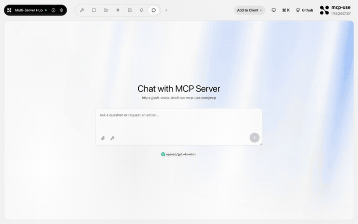
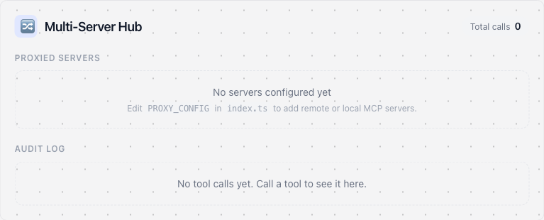

# Multi Server Hub — Compose MCP servers with middleware

<p>
  <a href="https://github.com/mcp-use/mcp-use">Built with <b>mcp-use</b></a>
  &nbsp;
  <a href="https://github.com/mcp-use/mcp-use">
    
  </a>
</p>

Showcase of `server.proxy()` — compose multiple MCP servers behind a single gateway with typed middleware, audit logging, and a live hub dashboard widget.



## Try it now

Connect to the hosted instance:

```
https://soft-voice-4nxfi.run.mcp-use.com/mcp
```

Or open the [Inspector](https://inspector.manufact.com/inspector?autoConnect=https%3A%2F%2Fsoft-voice-4nxfi.run.mcp-use.com%2Fmcp) to test it interactively.

### Setup on ChatGPT

1. Open **Settings** > **Apps and Connectors** > **Advanced Settings** and enable **Developer Mode**
2. Go to **Connectors** > **Create**, name it "Multi Server Hub", paste the URL above
3. In a new chat, click **+** > **More** and select the Multi Server Hub connector

### Setup on Claude

1. Open **Settings** > **Connectors** > **Add custom connector**
2. Paste the URL above and save

## Features

- **Server proxy** — `server.proxy()` composes multiple upstream MCP servers
- **Typed middleware** — intercept and transform requests between servers
- **Audit logging** — track all tool calls across proxied servers
- **Hub dashboard** — live widget showing connected servers and status

## Tools

| Tool | Description |
|------|-------------|
| `hub-status` | Show status of all connected servers with a live dashboard |
| `hub-config-example` | Show the proxy configuration |
| `audit-log` | View the audit trail of recent tool calls |

## Available Widgets

| Widget | Preview |
|--------|---------|
| `hub-dashboard` |  |

## Local development

```bash
git clone https://github.com/mcp-use/mcp-multi-server-hub.git
cd mcp-multi-server-hub
npm install
npm run dev
```

## Deploy

```bash
npx mcp-use deploy
```

## Built with

- [mcp-use](https://github.com/mcp-use/mcp-use) — MCP server framework

## License

MIT
